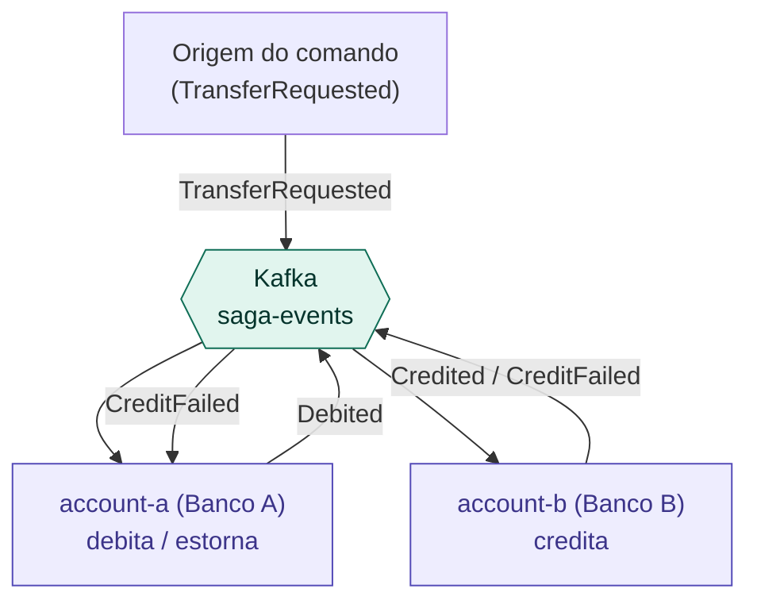
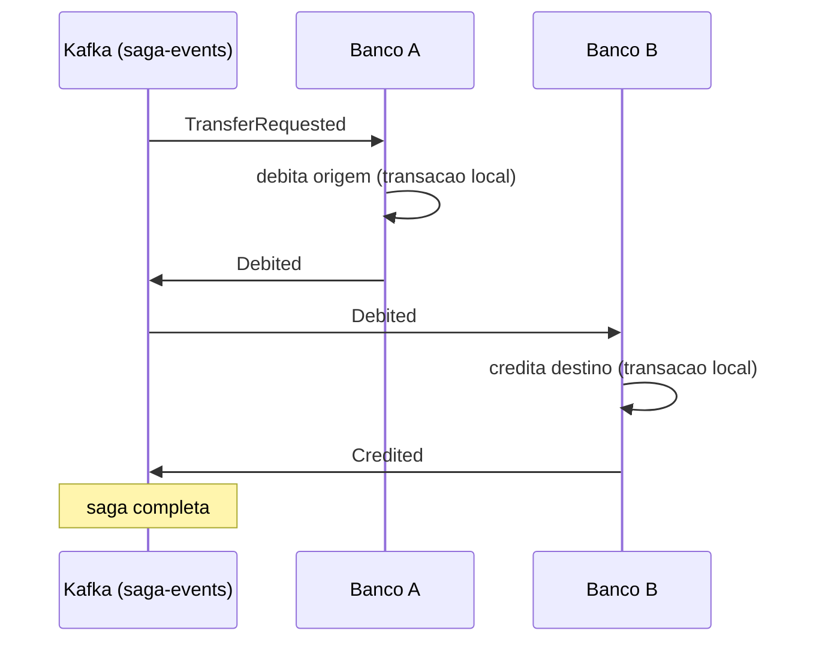
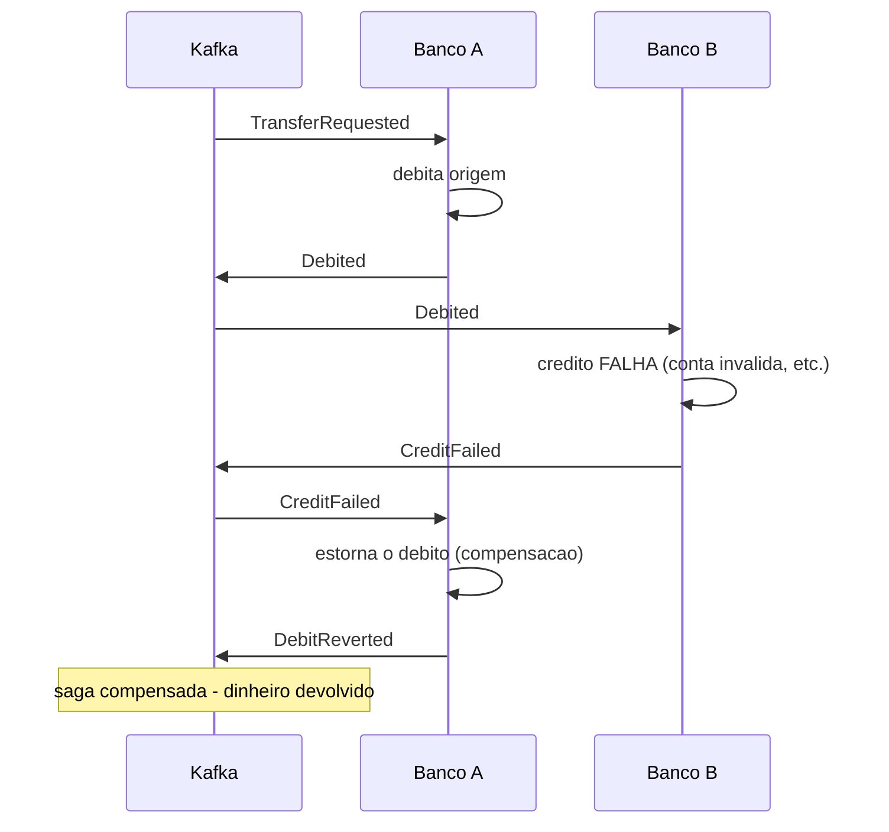

# Arquitetura - saga-transfer

Transferencia entre dois bancos distintos (Banco A -> Banco B) usando o padrao
Saga. Cada banco e um servico com seu proprio database; a consistencia entre eles
vem de compensacao, nao de transacao distribuida.

## Princípio central

Cada passo da saga e uma transacao LOCAL committada no seu servico. Nao existe
ACID entre os dois bancos. Se um passo falha, os anteriores sao desfeitos por
operacoes inversas (compensacao). Ver [ADR 0001](decisions/0001-saga-vs-2pc.md).

## C4 - Contexto

## Fluxo feliz (coreografado)

## Fluxo de compensação

## Coreografia: como os bancos cooperam sem coordenador

- Os dois bancos escutam o MESMO topico (`saga-events`), com `groupId`
  diferentes (`account-a`, `account-b`). Grupos diferentes recebem COPIAS de cada
  mensagem, entao os dois veem todos os eventos e cada um reage so ao que e dele.
- Banco A reage a `TransferRequested` (debita) e a `CreditFailed` (estorna).
- Banco B reage a `Debited` (credita).
- Ninguem coordena. Cada servico reage a fatos (eventos no passado) e emite o
  proximo fato. Isso e a saga COREOGRAFADA.

A versao ORQUESTRADA (modulo `orchestrator`) fica como evolucao: um coordenador
central com maquina de estados comanda os passos. Comparacao em
[ADR 0002](decisions/0002-coreografada-vs-orquestrada.md).

## Confiabilidade em cada servico

Cada banco reusa os mesmos padroes (do modulo `common`):
- **Outbox:** o evento e gravado na mesma transacao do debito/credito, e um relay
  publica no Kafka depois. Consistencia entre banco e broker sem 2PC.
- **Idempotencia:** cada evento processado e registrado (`processed_event`); uma
  reentrega nao debita/credita duas vezes.
- **Envelope:** todo evento publicado carrega eventId, eventType, sagaId e
  payload. Ver [ADR 0003](decisions/0003-envelope-de-evento.md).

## Particionamento

O relay publica usando o `sagaId` como chave de particao. Assim, todos os eventos
de uma mesma transferencia caem na mesma particao e sao processados em ordem;
sagas diferentes correm em paralelo.

## Modelo de dados (por servico)

Cada banco tem seu proprio database (`account_a`, `account_b`) com as tabelas:
`account`, `outbox`, `processed_event`. Detalhe em [`data-model.md`](data-model.md).
